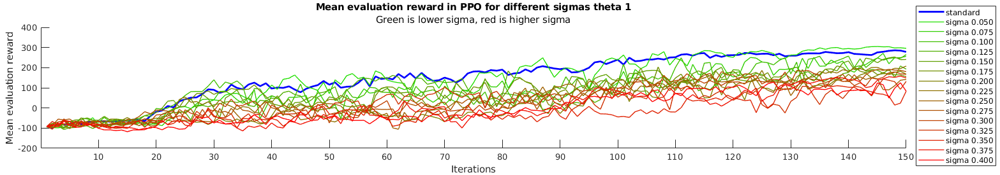
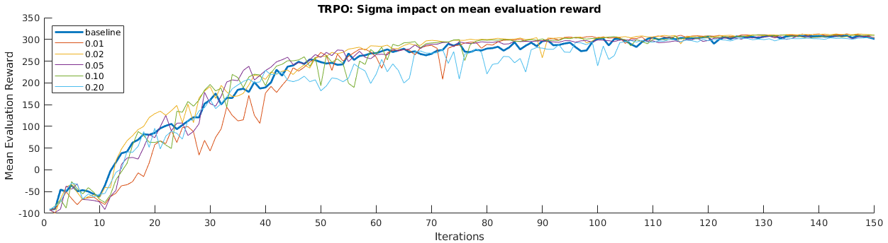
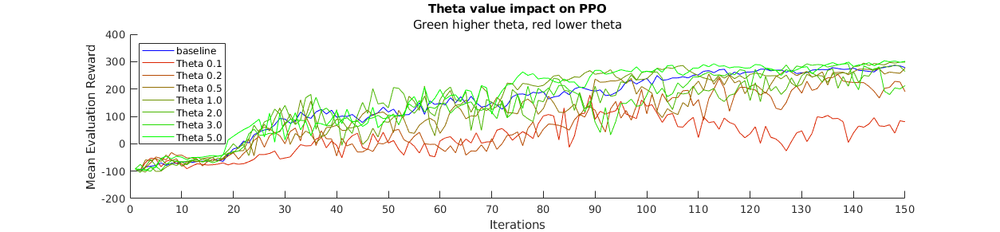
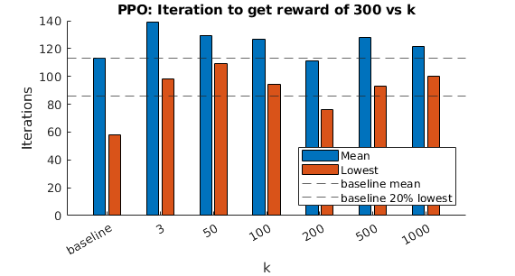

<!-- present all plots in thi folder -->
<!-- make title "Plot archive/presentation" -->

# Plot archive/presentation
<!-- make subtitle "Ornstein-Uhlenbeck" -->

##Ornstein-Uhlenbeck action noise

<!-- show OU_ex.png -->
### Example

### σ-test

### θ-test

## Re3
### k-test

##combined test

## Best runs and average
